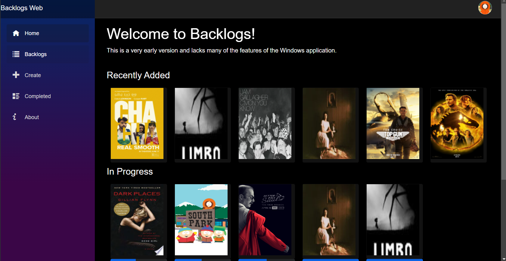
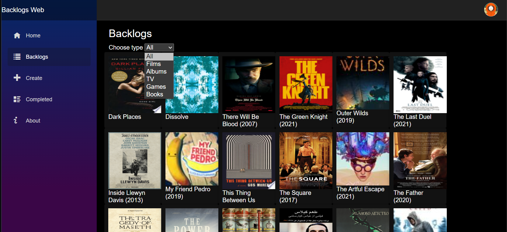
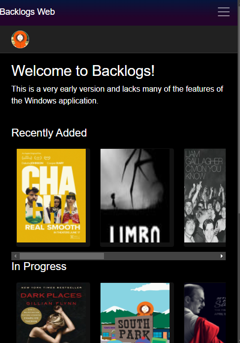

# Backlogs Web

Backlogs Web is the web version of the Windows application <a href="https://github.com/surya-sk/backlogs">Backlogs</a>. For a better user experience, native performance and more features like notifications and live tiles, download the app from the Microsoft Store.

This web application is completely free and open-source (licensed under the GNU GPL 3), just like the Windows application. The purpose of making this application was to provide users to access it on non-Windows devices. This app is built using Blazor WASM.

Link: https://backlogs.azurewebsites.net/

## Screenshots
<table><tr>
<td>  </td>
<td>  </td>
<td>  </td>
</tr></table>
